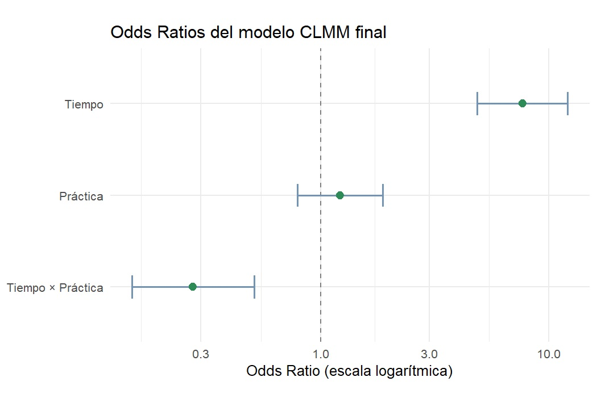

## ¿Cuándo usar los Modelos mixtos de enlace acumulativo (CLMM)?

En investigación en áreas como educación, salud, psicología, ciencias sociales es muy común recoger respuestas en escalas tipo Likert o en categorías ordenadas como *"nunca / a veces / siempre"*, *"nada importante a muy importante"*, *"no conozco la práctica / la conozco / la implemento"*. Estas variables son **ordinales**: las categorías tienen un orden, pero no sabemos si la distancia entre ellas es uniforme o comparable. Por ejemplo, si mi escala tiene 3 niveles ¿tiene sentido asumir que la distancia entre "nunca" y "a veces" es exactamente igual a la distancia entre "a veces" y "siempre"? Probablemente no.

Ahora bien, tratar estas variables como numéricas no es siempre incorrecto. Con escalas de muchos niveles, distribuciones razonablemente simétricas y sin violaciones de supuestos, un modelo lineal puede dar resultados perfectamente válidos. El problema aparece cuando la escala tiene **pocos niveles**, cuando la **distribución está muy sesgada**, o cuando al modelarla **se violan supuestos** de los modelos lineales. En esos casos, forzar una variable ordinal dentro de un modelo lineal puede distorsionar los resultados.

Para estas situaciones, los **Cumulative Link Mixed Models o Modelos mixtos de enlace acumulativo (CLMM)** son una alternativa más apropiada.

---

## 0. Setup

```{r, echo=TRUE, warning=FALSE, message=FALSE}

# Instalar paquetes si no los instalaste antes
if (!requireNamespace("ordinal", quietly = TRUE)) install.packages("ordinal")
if (!requireNamespace("emmeans", quietly = TRUE)) install.packages("emmeans")
if (!requireNamespace("tidyverse", quietly = TRUE)) install.packages("tidyverse")

# Cargar paquetes
library(tidyverse)
library(ordinal)
library(emmeans)

```


---


## 1. ¿Qué es un CLMM?

Un **modelo de enlace acumulativo** (*CLM*) modela la probabilidad acumulada de estar *en o por debajo de* una categoría ordinal dada. En lugar de predecir un valor numérico, predice qué tan probable es que una respuesta caiga en las categorías más bajas o más altas de la escala.

Para entender la idea, pensemos en un ejemplo concreto. Supongamos que le preguntamos a un grupo de estudiantes cómo se sienten antes de rendir un examen: *tranquilo*, *algo nervioso*, o *muy nervioso*. Antes de un taller de técnicas de estudio, casi todos caen en las dos últimas categorías. Después de participar del taller, muchos se mueven hacia *tranquilo* o *algo nervioso*. Un modelo lineal te diría algo como "el promedio bajó 0.4 puntos", lo cual no es muy informativo cuando nuestra escala tiene tres categorías y no sabemos bien qué significa "medio nervioso". El CLM, en cambio, nos permite responder las preguntas ¿aumentaron las chances de estar en una categoría más tranquila después del taller? Si el resultado es significativo y el el tamaño del efecto (odds ratio) es, digamos, 3.2, podemos decir que tras el taller las chances de reportar menor nerviosismo fueron tres veces más altas que antes. 


Para una variable con *K* categorías, el modelo estima *K–1* umbrales (*thresholds*), uno por cada punto de corte de la escala, y el efecto de los predictores sobre esas probabilidades. La forma general es:

$$\text{logit}[P(Y \leq k)] = \theta_k - \mathbf{x}^\top \boldsymbol{\beta}$$

Donde:
- $\theta_k$ son los umbrales entre categorías (un intercepto por cada corte)
- $\boldsymbol{\beta}$ son los coeficientes de los predictores
- El signo negativo hace que valores más altos del predictor se asocien con categorías más altas de la respuesta

El supuesto central del modelo es el de **proporcionalidad de los odds**: el efecto del predictor es el mismo a través de todos los puntos de corte de la escala. Dicho de otro modo, el predictor "desplaza" la distribución de respuestas de manera uniforme, sin importar en qué par de categorías estemos mirando. Es un supuesto razonable en muchos contextos, pero vale la pena verificarlo, y lo vamos a hacer más adelante.

La versión **mixta** del CLM, **CLMM**, simplemente agrega un **intercepto aleatorio por participante**. Esto es necesario cuando cada persona responde múltiples ítems o en múltiples momentos (por ejemplo, pre y post test). Sin ese componente aleatorio, estaríamos ignorando que las respuestas de una misma persona no son independientes entre sí.

---

## 2. Simulación del dataset


Vamos a simular un dataset para los siguientes datos. Imaginemos una **evaluación de capacitación** en la que medimos, antes y después del taller, el conocimiento de los participantes sobre dos prácticas de trabajo distintas. Para cada práctica, los participantes eligen una de tres categorías:

| Código | Etiqueta |
|--------|----------|
| 1 | No conozco esta práctica |
| 2 | La conozco, pero nunca la implementé |
| 3 | La he implementado |

Tenemos **150 participantes**, **2 prácticas**, y dos momentos de evaluación (**pre** y **post**).


```{r, echo=TRUE, warning=FALSE, message=FALSE}

set.seed(42)

# Parámetros
n_participantes <- 150
practicas <- c("Práctica A", "Práctica B")
tiempos <- c("pre", "post")

# Creamos el dataset en formato largo
library(tidyverse)

df <- expand.grid(
  id          = 1:n_participantes,
  practica    = practicas,
  tiempo      = tiempos
) |>
  arrange(id, practica, tiempo)

# Simulamos respuestas ordinales (1, 2, 3)
# En "post", las probabilidades se desplazan hacia categorías más altas
simular_respuesta <- function(tiempo, practica) {
  if (tiempo == "pre") {
    probs <- c(0.50, 0.35, 0.15)
  } else {
    # El efecto del taller varía un poco por práctica
    probs <- case_when(
      practica == "Práctica A" ~ list(c(0.15, 0.35, 0.50)),
      practica == "Práctica B" ~ list(c(0.25, 0.40, 0.35))
    )[[1]]
  }
  sample(1:3, 1, prob = probs)
}

df <- df |>
  rowwise() |>
  mutate(respuesta = simular_respuesta(tiempo, practica)) |>
  ungroup()

# Convertimos a factor ordinal
df <- df |>
  mutate(
    respuesta_ord = factor(
      respuesta,
      levels = 1:3,
      labels = c("No conozco", "Conozco, no implementé", "Implementé"),
      ordered = TRUE
    ),
    tiempo   = factor(tiempo, levels = c("pre", "post")),
    practica = factor(practica)
  )

glimpse(df)

```


Veamos como se distribuyen las respuestas antes y después de la capacitación para cada práctica.


```{r, echo=TRUE, warning=FALSE, message=FALSE}

# Frecuencias por tiempo y práctica
df |>
  count(tiempo, practica, respuesta_ord) |>
  group_by(tiempo, practica) |>
  mutate(pct = n / sum(n) * 100) |>
  ggplot(aes(x = respuesta_ord, y = pct, fill = tiempo)) +
  geom_col(position = "dodge") +
  facet_wrap(~practica, ncol = 2) +
  scale_fill_manual(values = c("pre" = "#7393B3", "post" = "#2E8B57")) +
  labs(
    title = "Distribución de respuestas por práctica y momento de evaluación",
    x     = "Respuesta",
    y     = "Porcentaje (%)",
    fill  = "Evaluación"
  ) +
  theme_minimal(base_size = 13) +
  theme(axis.text.x = element_text(angle = 20, hjust = 1))


```

Podemos ver que para ambas prácticas disminuye el porcentaje de respuestas "No conozco" luego de la capacitación y también aumenta el porcentaje de respuestas "Implementé". A su vez, los patrones de cambio entre el pre y post no parecen ser iguales entre ambas prácticas.  

---

## 3. Selección de modelos

Seguimos una estrategia **jerárquica**. Partimos del modelo más simple e incorporamos predictores uno a uno, evaluando si el ajuste mejora con **pruebas de razón de verosimilitud (Likelihood ratio tests, LRT)**.

```{r, echo=TRUE, warning=FALSE, message=FALSE}

# Paso 1: Modelo nulo (solo intercepto aleatorio)
m0 <- clmm(respuesta_ord ~ 1 + (1 | id), data = df)

# Paso 2: Agregar tiempo
m1 <- clmm(respuesta_ord ~ tiempo + (1 | id), data = df)

# Paso 3: Agregar práctica
m2 <- clmm(respuesta_ord ~ tiempo + practica + (1 | id), data = df)

# Paso 4: Agregar la interacción tiempo × práctica
m3 <- clmm(respuesta_ord ~ tiempo * practica + (1 | id), data = df)

# Comparación con LRT
anova(m0, m1, m2, m3)
```

**¿Cómo interpretar la tabla?**  

Buscamos el modelo donde el AIC disminuya y el p-valor del LRT sea significativo (< 0.05). Retenemos el **modelo más parsimonioso** (más simple) que mejore significativamente el ajuste. Por ejemplo, si la interacción `tiempo × práctica` no mejora significativamente el ajuste, nos quedamos con `m2`.

Sin embargo, en este caso en particular:

- m0 → m1: agregar el tiempo o momento de evaluación (pre/post) baja el AIC de 1379 a 1246, y el LRT es significativo (p < 0.001). 
- m1 → m2: agregar la práctica hace que el AIC baje también y el LRT sigue siendo significativo. Las prácticas difieren entre sí.
- m2 → m3: agregar la interacción tiempo × práctica hace que el AIC baje y el LRT también es significativo. Esto indica que el efecto de la capacitación no fue igual para ambas prácticas, en una de ellas el cambio fue mayor que en la otra.

Conclusión: el modelo final es m3, el que incluye la interacción. Todos los pasos mejoraron el ajuste significativamente, así que ninguno se descarta.


---

## 4. Verificación del supuesto de odds proporcionales

El supuesto de **proporcionalidad de los odds** establece que el efecto de los predictores es constante a lo largo de todos los puntos de corte de la escala. Si se viola, el modelo no es apropiado.

Lo testeamos con un LRT comparando el modelo proporcional vs. uno que permite efectos distintos por umbral (modelo nominal). Esto se hace con modelos `clm` (sin efectos aleatorios) por limitaciones computacionales.


```{r, echo=TRUE, warning=FALSE, message=FALSE}

# Modelo proporcional (cumulative link)
m_prop <- clm(respuesta_ord ~ tiempo * practica, data = df)

# Modelo no restringido (nominal)
m_nom  <- clm(respuesta_ord ~ 1, nominal = ~ tiempo * practica, data = df)

# LRT: si p > 0.05, el supuesto se sostiene
anova(m_prop, m_nom)
```

> El p-valor es **mayor a 0.05**, por lo tanto, no hay evidencia para rechazar el supuesto de proporcionalidad y podemos proceder con el modelo CLMM estándar.

---

## 5. Interpretación de resultados

Una vez seleccionado el modelo final, extraemos los **odds ratios (OR)** con sus IC 95%. ¿Cómo los interpretamos?

- OR > 1: el predictor aumenta las chances de estar en una categoría más alta de la escala.
- OR = 1: no hay diferencia respecto a la categoría de referencia.
- OR < 1: el predictor reduce las chances de estar en una categoría más alta.
- IC 95% que no incluye el 1: el efecto es estadísticamente significativo.


```{r, echo=TRUE, warning=FALSE, message=FALSE}


# Coeficientes en escala log-odds
summary(m3)
cf <- summary(m3)$coefficients

# Extraemos los intervalos de confianza en escala log-odds
ci <- confint(m3)

# Convertimos a data frame
ci_df <- as.data.frame(ci)
ci_df$term <- rownames(ci_df)

# Unimos los IC con los coeficientes
or_tabla <- data.frame(
  term = rownames(cf),
  OR   = exp(cf[, "Estimate"])
) |>
  dplyr::left_join(ci_df, by = "term") |>
  dplyr::rename(
    IC_low  = `2.5 %`,
    IC_high = `97.5 %`
  ) |>
  dplyr::mutate(
    IC_low  = exp(IC_low),
    IC_high = exp(IC_high)
  ) |>
  dplyr::filter(!grepl("\\|", term))  # sacar umbrales

or_tabla


```


**En el caso de nuestros datos:**

**`tiempopost` (OR = 7.66, IC: 4.86 – 12.08):** para la Práctica A (categoría de referencia), las chances de estar en una categoría más alta de conocimiento después del taller fueron casi **8 veces mayores** (7.66) que antes. El IC no incluye el 1, así que el efecto es estadísticamente significativo.

**`practicaPráctica B` (OR = 1.22, IC: 0.79 – 1.88):** en el momento pre (categoría de referencia), no hay diferencia significativa en el nivel de conocimiento entre ambas prácticas, el IC incluye el 1. Arrancan parejas.

**`tiempopost:practicaPráctica B` (OR = 0.28, IC: 0.15 – 0.51):** el efecto del taller fue significativamente menor para la Práctica B que para la A. Para obtener el efecto total del taller sobre la Práctica B, se combinan ambos coeficientes: OR = 7.66 × 0.28 ≈ **2.14**. Es decir, en la Práctica B, las chances (odds) acumuladas de estar en una categoría más alta en post vs. pre son aproximadamente 2.14 veces mayores, mientras que en la Práctica A se multiplicaron por casi 8.

Como regla general: un **OR > 1** indica mayor probabilidad de estar en una categoría más alta; **OR = 1** indica ausencia de efecto; y un **IC 95% que no incluye el 1** señala un efecto estadísticamente significativo.


---

## 6. Comparaciones pareadas entre prácticas

Para saber si las prácticas difieren entre sí, usamos comparaciones múltiples con ajuste de Tukey mediante el paquete emmeans. 

Como en nuestros datos la interacción entre tiempo de evaluación y práctica es significativa, entendemos que el efecto de la práctica no es el mismo en los dos momentos (pre/post). Las prácticas se comportan distinto. Por eso no tiene sentido compararlas colapsando sobre el tiempo; estaríamos promediando algo que varía. Lo correcto es compararlas por separado en cada momento.


```{r, echo=TRUE, warning=FALSE, message=FALSE}

# Comparación entre prácticas en cada momento por separado
emm <- emmeans(m3, ~ practica | tiempo, mode = "linear.predictor")

pares <- pairs(emm, adjust = "tukey")

confint(pares, type = "response") |>
  as_tibble() |>
  mutate(across(where(is.numeric), ~round(., 3)))

```

Un detalle importante: en modelos ordinales acumulativos, el predictor lineal interno apunta hacia las categorías bajas de la escala, lo que hace que la dirección de los contrastes sea la siguiente:

- **Pre (OR = 1.22, IC: 0.79 – 1.88)**: antes del taller, las chances de estar en una categoría **más baja** son similares entre ambas prácticas 
- **Post (OR = 0.34, IC: 0.22 – 0.52)**: después del taller, las chances de estar en una categoría más **baja** son significativamente menores (el OR es menor a 1 y el IC no lo incluye) en la Práctica A que en la Práctica B.

Si queremos invertir la dirección del contraste, usamos `reverse = TRUE` en la función `pairs()`. De esa forma, valores mayores a 1 indican que la Práctica tiene mayores chances de estar en categorías más altas.

```{r, echo=TRUE, warning=FALSE, message=FALSE}


pares <- pairs(emm, adjust = "tukey", reverse = TRUE)

confint(pares, type = "response") |>
  as_tibble() |>
  mutate(across(where(is.numeric), ~round(., 3)))

```

**¿Cómo interpretamos estos resultados?**

**Post (OR = 2.96, IC: 1.92 – 4.59)**: después del taller, las chances de estar en una categoría más alta son casi 3 veces mayores en la Práctica A que en la B. Esto es consistente con lo que vimos en el gráfico descriptivo: la Práctica A pasó de un 12% a un 59% en la categoría "Implementé", mientras que la Práctica B tuvo un cambio mucho más pequeño.

---

## 7. Visualización de los coeficientes

Una forma de visualizar los coeficientes estimados del modelo que seleccionamos es mediante un **forest plot**. En este gráfico, cada punto representa un odds ratio y las líneas horizontales su IC 95%. 

```{r, echo=TRUE, warning=FALSE, message=FALSE}


or_plot_data <- or_tabla |>
  mutate(term = case_when(
    term == "tiempopost"                    ~ "Tiempo",
    term == "practicaPráctica B"            ~ "Práctica",
    term == "tiempopost:practicaPráctica B" ~ "Tiempo × Práctica"
  ))

ggplot(or_plot_data, aes(x = OR, y = reorder(term, OR))) +
  geom_vline(xintercept = 1, linetype = "dashed", color = "gray50") +
  geom_errorbarh(aes(xmin = IC_low, xmax = IC_high),
                 height = 0.25, color = "#7393B3", linewidth = 0.8) +
  geom_point(size = 3, color = "#2E8B57") +
  scale_x_log10() +
  labs(
    title = "Odds Ratios del modelo CLMM final",
    x     = "Odds Ratio (escala logarítmica)",
    y     = NULL
  ) +
  theme_minimal(base_size = 13)

```
La línea punteada vertical en 1 es la referencia: puntos a la derecha indican mayores chances de estar en categorías más altas, puntos a la izquierda indican menores chances. Si el IC cruza la línea punteada, el efecto no es estadísticamente significativo. El eje x está en escala logarítmica, lo que es apropiado para los OR porque hace que distancias iguales representen multiplicaciones iguales. Por ejemplo, 0.5 y 2 quedan a la misma distancia del 1, lo que refleja que ambos representan el mismo "tamaño" de efecto en direcciones opuestas. 

---

**Cómo citar este tutorial**

Formoso, J. (2026, abril 7). Modelos mixtos de enlace acumulativo (CLMM): un tutorial paso a paso en R. Zenodo. https://doi.org/10.5281/zenodo.19445681

Este tutorial está disponible bajo una licencia [Creative Commons Attribution 4.0 International (CC BY 4.0)](https://creativecommons.org/licenses/by/4.0/). Podés compartirlo y adaptarlo libremente siempre que cites la fuente.


---

## Referencias

- Christensen, R. H. B. (2023). *ordinal: Regression Models for Ordinal Data*. R package. https://cran.r-project.org/package=ordinal
- Lenth, R. V. (2024). *emmeans: Estimated Marginal Means*. R package. https://cran.r-project.org/package=emmeans
- Agresti, A. (2010). *Analysis of Ordinal Categorical Data* (2nd ed.). Wiley.
- McCullagh, P. (1980). Regression models for ordinal data. *Journal of the Royal Statistical Society: Series B*, 42(2), 109–127.

---

*¿Preguntas o sugerencias? Dejá un issue [aquí](https://github.com/JFormoso/jformoso.github.io/issues) o escribime a [jesica.formoso@gmail.com](mailto:jesica.formoso@gmail.com) con tus comentarios.*


