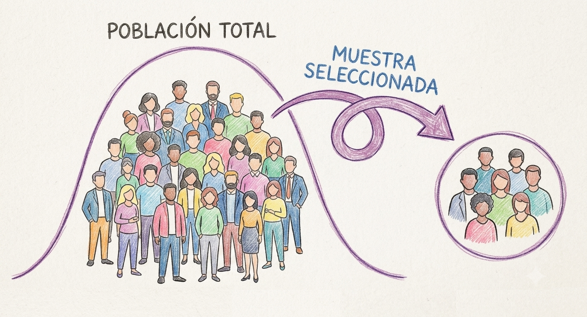

## Por qué calcular el tamaño de la muestra

¿Alguna vez te preguntaste cuántas observaciones necesitás para poner a prueba tu hipótesis? Me refiero a qué número concreto, defendible, que puedas escribir en un protocolo de investigación o justificar ante un comité de ética necesitás. Esa pregunta tiene respuesta, y se llama análisis de poder.

La intuición detrás es simple: si testeás muy pocos casos, corrés el riesgo de no detectar un efecto que realmente existe, aunque tu hipótesis sea correcta. Si testeás de más, estás gastando tiempo, plata, o exponiendo a más participantes de los necesarios a un estudio. El análisis de poder te da el n mínimo razonable para tener una buena chance de detectar el efecto que te interesa, dado lo que ya sabés (o suponés) sobre su tamaño.

El objetivo de este tutorial es entender cómo podemos calcularlo para los diseños más comunes (comparar dos grupos (t de Student), comparar más de dos grupos (ANOVA), correlación y regresión lineal) y como podemos aplicarlo usando R. En una segunda parte, vamos a extender esto a modelos mixtos, pero vayamos por partes.


## La lógica de la prueba de hipótesis

Imaginemos que nos interesa saber si un método de enseñanza basado en **práctica de recuperación** (hacer que los estudiantes se autoevalúen activamente) produce mejores resultados en un examen que el **método tradicional** (relectura). No tenemos acceso a la población completa, no podemos testear a todos los estudiantes, pero podemos acceder a una muestra, y en base a ella tomar una decisión sobre nuestra hipótesis y esa decisión puede coincidir con la realidad o no.

Cuando realizamos un test de hipótesis, la decisión se toma en base a si la evidencia nos permite o no rechazar la llamada hipótesis nula o hipótesis del no efecto. En el caso de nuestro ejemplo:

- **$H_0$ (hipótesis nula):** no hay diferencia en el puntaje promedio de examen entre el método tradicional y la práctica de recuperación. Es igual a decir que el método de estudio no tiene efecto sobre el puntaje promedio del examen.

- **$H_1$ (hipótesis alternativa):** la práctica de recuperación produce un puntaje promedio distinto que el método tradicional, es decir, el método de estudio sí tiene un efecto sobre el puntaje promedio del examen. 

Ahora, decidir rechazar o no rechazar $H_0$ en base a una muestra siempre deja abierta la posibilidad de equivocarse y hay dos formas distintas de equivocarse:

- Podemos concluir que el nuevo método funciona mejor (hay diferencias en nuestra muestra) cuando en realidad no es así (no hay diferencias reales en la población): es un **falso positivo**.  
- Podemos concluir que no hay evidencia de mejora (en nuestra muestra) cuando el método en realidad sí funciona: es un **falso negativo**. 


Entonces tenemos cuatro escenarios posibles:

| | **H0 es verdadera**<br>(los dos métodos son igual de efectivos) | **H0 es falsa**<br>(la práctica de recuperación sí funciona mejor) |
|---|---|---|
| **No rechazo H0**<br>(concluyo "no hay evidencia de diferencia") | Decisión correcta (1−$\alpha$) | Error de Tipo II — probabilidad $\beta$ |
| **Rechazo H0**<br>(concluyo "la práctica de recuperación es mejor") | Error de Tipo I — $\alpha$ (nivel de significación) | Decisión correcta — Poder (1−$\beta$) |

**Error de Tipo I ($\alpha$):** rechazar $H_0$ siendo verdadera, el falso positivo de arriba. La probabilidad de cometer este tipo de error es $\alpha$, es el nivel de significación que definimos nosotros de antemano y que, por convención, suele ser 0.05. Esto implica que aceptamos un 5% de probabilidad de recomendar el nuevo método sin que realmente sea mejor.

**1−$\alpha$:** el complemento del nivel de significación, y habla de la probabilidad de no rechazar $H_0$ cuando efectivamente es verdadera. Con $\alpha$ = 0.05, el nivel de confianza es 95%.

**Error de Tipo II ($\beta$):** Nos habla de la probabilidad de no rechazar $H_0$ siendo falsa. Es el falso negativo. A diferencia de $\alpha$, $\beta$ no se fija de antemano, sino que depende del tamaño real de la diferencia entre métodos, del tamaño muestral y de la varianza. Por eso, en la mayoría de los casos, no se puede calcular $\beta$ con precisión sin antes asumir un tamaño del efecto específico.

**Poder (1−$\beta$):** es el complemento de $\beta$, la probabilidad de detectar correctamente que la práctica de recuperación sí funciona mejor, dado que efectivamente funciona mejor. Es el **poder** de nuestra prueba de hipótesis. Esta es la casilla que nos interesa maximizar, y es lo que vamos a calcular durante el resto del tutorial.

::: {.callout-note}

Los riesgos de ambos errores están relacionados. A igual tamaño muestral, bajar $\alpha$ (exigir más evidencia antes de declarar que el método nuevo funciona) generalmente sube $\beta$ (aumenta el riesgo de no detectar una mejora real). La única forma de bajar ambos simultáneamente es aumentar el tamaño muestral, es decir, testear a más estudiantes. Y ese es, en el fondo, el problema que resuelve un análisis de poder: dado un $\alpha$ que estamos dispuestos a aceptar y una diferencia (efecto) que nos interesa detectar, ¿qué n necesitamos para tener un $\beta$ aceptablemente bajo?

:::


## ¿Qué es el poder estadístico de la prueba?

Sigamos con nuestro ejemplo. Supongamos que en base a una prueba piloto pequeña que realizamos, tenemos una primera estimación. El grupo que estudió con el método tradicional obtuvo un puntaje medio de 68.5 en el examen, con un desvío estándar de 10; en cambio, quienes utilizaron la práctica de recuperación obtuvieron un puntaje medio de 73 (mismo desvío). Con estos números ya podemos preguntarnos directamente cuántos estudiantes necesitamos para tener una buena chance de detectar esa diferencia de 4.5 puntos, si realmente existe en la población.

Esa "buena chance" es el poder estadístico: la probabilidad de rechazar correctamente $H_0$ cuando efectivamente existe un efecto real, en este caso, la probabilidad de que el estudio detecte la mejora de 4.5 puntos, dado que esa mejora realmente existe. Se calcula en función de cuatro elementos interrelacionados:

- **El tamaño del efecto**: acá, los 4.5 puntos de diferencia entre medias, relativos a la variabilidad de los puntajes
- **El tamaño muestral** (n): cuántos estudiantes por grupo
- **El nivel de significación** ($\alpha$, típicamente .05)
- **La variabilidad** de la variable de interés: el desvío estándar de 10 puntos

Fijados tres de estos cuatro valores, el cuarto queda determinado. Esto es exactamente lo que hacen las funciones de R que vamos a usar: les damos tres valores y nos devuelven el cuarto. Típicamente resolvemos el n necesario dado un poder deseado (convencionalmente .80).


## Cálculo del poder con R

### Algunas cuestiones claves antes de iniciar con el código

Para este tutorial vamos a utilizar el paquete `pwr`[@champely2020pwr] ejecutado en R [@rcoreteam2024r].


```{r}
#| label: setup

# Instalar el paquete si no lo instalaste antes
if (!requireNamespace("pwr", quietly = TRUE)) install.packages("pwr")

# Cargar el paquete
library(pwr)
```

Este paquete implementa los cálculos de poder para los diseños clásicos, usando las convenciones y tamaños del efecto estandarizados que propuso @cohen1988statistical. Algo importante a tener en cuenta es que las funciones de `pwr` generalmente esperan **tamaños del efecto estandarizados** (d de Cohen, f de Cohen) como argumento, en lugar de estadísticos crudos como medias o desvíos directamente. Esto significa que antes de llamar a la función tenemos que convertir los datos del piloto a un tamaño del efecto estandarizado.

Para el caso de dos grupos, la d de Cohen es la diferencia de medias dividida por el desvío estándar común. 

$$d = \frac{\bar{x}_1 - \bar{x}_2}{s}$$
Donde:

- $\bar{x}_1$ y $\bar{x}_2$ son las medias de los dos grupos que se comparan

- $s$ es el desvío estándar combinado de ambos grupos

¡Un detalle importante! Cuando los desvíos son iguales en ambos grupos (varianza homogénea), el desvío estándar combinado es ese mismo valor. Si los dos grupos no tienen exactamente el mismo desvío estándar, el desvío combinado $s$ pondera los desvíos de ambos grupos según su tamaño muestral:

$$s = \sqrt{\frac{(n_1-1)s_1^2 + (n_2-1)s_2^2}{n_1+n_2-2}}$$

Donde $n_1$ y $n_2$ son los tamaños muestrales de los grupos 1 y 2, y $s_1$ y $s_2$ son los desvíos estándar de cada grupo. 

Con los datos de nuestro estudio:

$$d = \frac{\bar{x}_1 - \bar{x}_2}{s} = \frac{73 - 68.5}{10} = 0.45$$

Este valor coincide con lo que Cohen (1988) definió como un efecto "mediano". Pero acá no lo estamos tomando de una tabla de valores convencionales sino que lo derivamos directamente de nuestros datos piloto. Esto siempre es preferible a usar una convención genérica.


### Poder para un t-test de dos muestras


Con d = 0.45 y queriendo 80% de poder con alfa = .05, le preguntamos directamente a R:

```{r}
#| label: pwr-t-test05


pwr.t.test(d = 0.45, sig.level = 0.05, power = 0.80, type = "two.sample")

```

En base a los datos que tenemos, el cálculo nos muestra que necesitamos aproximadamente **78 estudiantes por grupo** (156 en total) para tener 80% de probabilidad de detectar una diferencia de 4.5 puntos, si esa diferencia efectivamente existe.

`pwr.t.test()` calcula el poder (o el n, o el tamaño del efecto, o el $\alpha$) para tests t de una muestra o de dos muestras de igual tamaño, con argumentos `n`, `d`, `sig.level`, `power` y `type` (`"two.sample"`, `"one.sample"`, o `"paired"`). Se deja vacío (`NULL`) exactamente el que se quiere resolver. 
Si tuvieramos un n fijo (por ejemplo, porque la evaluación se realiza sobre un mismo curso y ese curso tiene 40 estudiantes) y queremos saber qué poder tenemos con ese n, simplemente hacemos lo siguiente:

```{r}
#| label: pwr-t-test2
#| eval: true

pwr.t.test(d = 0.45, sig.level = 0.05, n = 40, type = "two.sample")

```

Si quisiéramos calcular el n para un tamaño de efecto más pequeño, simplemente cambiamos d:

```{r}
#| label: pwr-t-test03


pwr.t.test(d = 0.3, sig.level = 0.05, power = 0.80, type = "two.sample")

```

Podemos ver que a igual $\alpha$ (.05) y poder (.80), para detectar un tamaño del efecto más pequeño, necesitamos una muestra muchísimo más grande. Los invito a probar distintos valores de *d* para ver cómo se modifica el *n* mínimo. 

### Poder para un ANOVA de un factor

Supongamos que queremos comparar no dos, sino **tres** métodos de estudio: además del tradicional y la práctica de recuperación, incluimos **repetición espaciada** (distribuir el estudio en el tiempo en vez de concentrarlo). Con tres grupos, un t-test ya no alcanza. Hace falta un ANOVA de un factor.

Las hipótesis cambian de forma:

- **$H_0$:** las medias de puntaje son iguales entre los tres métodos.
- **$H_1$:** al menos una de las medias difiere de las demás.

Con base en el piloto y en literatura sobre repetición espaciada, estimamos las tres medias: tradicional 68.5, práctica de recuperación 73, repetición espaciada 77.5. Mismo desvío estándar de 10 en los tres grupos.


A diferencia de la d de Cohen (que compara exactamente dos medias), acá necesitamos un tamaño del efecto que resuma la dispersión de tres medias respecto de la variabilidad dentro de los grupos: la **f de Cohen**. 


$$f = \frac{\sigma_{medias}}{\sigma_{población}}$$

Donde:

- $\sigma_{medias}$ es el desvío estándar de las medias de los grupos
- $\sigma_{población}$ es el desvío estándar común dentro de los grupos

Con las medias que estimamos antes, lo calculamos de la siguiente forma:


```{r}
#| label: calcular-f-cohen
#| eval: true

medias <- c(68.5, 73, 77.5)
sd_comun <- 10
k <- length(medias)

sigma_medias <- sqrt(sum((medias - mean(medias))^2) / k)
f <- sigma_medias / sd_comun
f

```

Esto da f ≈ 0.37. Este es el desvío estándar de las tres medias de grupo, relativo al desvío común dentro de los grupos. Con ese valor calculo el *n* necesario para poner a prueba mi hipótesis:


```{r}
#| label: pwr-anova-test
#| eval: true

pwr.anova.test(k = 3, f = 0.37, power = 0.80, sig.level = 0.05)
```

El cálculo nos indica que necesitamos aproximadamente **25 estudiantes por grupo** (75 en total). ¿Por qué necesitamos menos por grupo que en el t-test (n = 78)? Porque la diferencia relativa entre el grupo más bajo y el más alto (68.5 a 77.5, 9 puntos) es proporcionalmente mayor que la diferencia de 4.5 puntos que comparamos antes. Y como venimos viendo, si el tamaño del efecto es más grande, necesitamos menos muestra para rechazar $H_0$ si esta es falsa. 

`pwr.anova.test()` toma `k` (número de grupos), `n`, `f`, `sig.level` y `power`, dejando `NULL` el que se quiere resolver, igual que las funciones anteriores.

Una aclaración importante para no llevarse una idea equivocada: cuando el ANOVA es significativo y rechazamos $H_0$, solo podemos concluir que **al menos una media difiere de las demás**, no cuál de ellas. Si queremos saber específicamente si, por ejemplo, la repetición espaciada es mejor que la práctica de recuperación, y no solo que "alguno de los tres métodos difiere de los otros", vamos a necesitar comparaciones post-hoc entre pares de grupos, algo que quedan fuera del alcance de este tutorial.

#### Visualizar la relación entre n y poder

Reportar un único número (n = 25 por grupo) a veces esconde qué tan sensible es esa decisión a pequeños cambios en los supuestos. Una forma más completa de comunicar el análisis, sobre todo en un protocolo o un proyecto de investigación, es graficar cómo cambia el poder a medida que aumenta el tamaño muestral. El paquete `pwr` permite hacer eso vía `plot()` sobre el objeto devuelto:

```{r, warning=FALSE, message=FALSE}
#| label: plot-power-curve
#| eval: true

resultado <- pwr.anova.test(k = 3, f = 0.37, power = 0.80, sig.level = 0.05)
plot(resultado)
```

Esto es especialmente útil si nos preocupa que la diferencia real entre métodos sea algo menor a la estimada en el piloto. La curva muestra de un vistazo cuánto más *n* haría falta en un escenario más conservador.


### Poder en correlación y regresión lineal

Hasta acá comparamos grupos categóricos (métodos de enseñanza). Pero también podría interesarnos preguntas como las siguientes:

1. ¿Las horas de estudio semanales se correlacionan con el puntaje de examen?
2. ¿Un modelo con varios predictores (horas de estudio y método de enseñanza) explica una proporción considerable de la variabilidad en el puntaje final?

Estas dos preguntas requieren dos funciones distintas de `pwr`, ninguna de las cuales usa d ni f como tamaño del efecto.

Nuevamente, necesitamos tener una idea de cuál será el tamaño del efecto. Nuestras opciones son ir a la bibliografía y buscar tamaños del efecto para análisis similares reportados por otros estudios o realizar un estudio piloto para estimar esos valores. Otra alternativa es usar valores estándar y asumir un tamaño del efecto moderado (ej. una d de Cohen de 0.5), pero se recomienda evitar esta opción.

#### Poder para una correlación

Ahora bien, digamos que a partir de nuestro estudio piloto estimamos una correlación de r = 0.35 entre horas de estudio semanales y puntaje. ¿Cuántos estudiantes necesitamos para un 80% de poder con un alfa = .05?

```{r}
#| label: pwr-r-test
#| eval: true
pwr.r.test(r = 0.35, sig.level = 0.05, power = 0.80)
```

Este cálculo indica que necesitamos aproximadamente **61 estudiantes** para tener 80% de probabilidad de detectar una correlación de esa magnitud, si efectivamente existe.

Acá el tamaño del efecto es directamente el coeficiente de correlación de Pearson, r (Cohen propuso r = 0.1 chico, 0.3 mediano, 0.5 grande como convención genérica, pero, igual que con la d, siempre es preferible derivar r de datos propios o estudios previos de otros grupos). 

Un detalle no tan obvio: como la distribución muestral de r no es normal (está acotada entre −1 y 1 y se vuelve más asimétrica cuanto más se aleja de 0), `pwr.r.test()` no calcula el poder sobre r directamente. Primero aplica la transformación **Z de Fisher**, que sí se distribuye aproximadamente normal, con una corrección de sesgo adicional, y calcula el poder sobre esa Z' transformada.


#### Poder para un modelo de regresión (modelo global)

Ahora nos interesa si saber si al incluir horas de estudio y método de enseñanza en un mismo modelo explican una proporción determinada de la varianza del puntaje del examen. En base la bibliografía previa, estimamos que, en conjunto, horas de estudio y método de enseñanza expliquen 20% de la variabilidad en el puntaje. En este caso calcularemos tamaño de la muestra para el modelo global, no para un predictor específico, y el tamaño del efecto que nos interesa es el $R^2$ (que esperamos que sea de 0.20 0 20%). En la regresión lineal, la $H_0$ es que $R^2$ = 0. Tenemos que encontrar cuántas observaciones necesitamos para rechazar $H_0$ si en la realidad $R^2$ = 0.20.

Para el modelo de regresión múltiple se usa la función `pwr.f2.test()`, que calcula el poder para el modelo lineal general, con el tamaño del efecto $f^2$ definido a partir del $R^2$:

$$f^2 = \frac{R^2}{1-R^2}$$
En nuestro ejemplo:

```{r}
#| label: r2-a-f2
#| eval: true
R2 <- 0.20
f2 <- R2 / (1 - R2)
f2
```

Esto da $f^2$ = 0.25 (convenciones de Cohen: 0.02 chico, 0.15 mediano, 0.35 grande). Ahora lo usamos con u = 3 grados de libertad del numerador.  

:::{.callout-note}

*u* representa los **grados de libertad del modelo**, es decir, cuántos parámetros nuevos estamos estimando respecto al modelo nulo. Y ahí hay una trampa: no todos los predictores "cuestan" 1 grado de libertad.

- Un predictor numérico continuo (como horas de estudio) siempre suma 1.
- Un predictor categórico con k niveles no suma 1, sino k − 1.

En nuestro ejemplo, método de estudio es una variable categórica con tres niveles (tradicional, práctica de recuperación, repetición espaciada), por lo que suma 3-1 = 2 grados de libertad. 

:::


```{r}
#| label: pwr-f2-test
#| eval: true
pwr.f2.test(u = 3, f2 = 0.25, sig.level = 0.05, power = 0.80)
```

¡Importante! Este cálculo devuelve `v` (grados de libertad del denominador), no `n` directamente. Para obtener el tamaño muestral total hay que despejar:

$$n = v + u + 1$$

```{r}
#| label: calcular-n-total-regresion
#| eval: true
n_total <- 43.70444 + 3 + 1
n_total
```

Entonces, en base al cálculo del poder estadístico, necesitamos **48 estudiantes en total** para tener 80% de poder de detectar que el modelo completo explica una proporción de varianza distinta de cero, si el $R^2$ real es de 0.20. 

Como mencioné antes, esto evalúa el modelo en conjunto, no dice si cada predictor individual (por ejemplo, el método de enseñanza controlando por las otras dos variables) es significativo por separado. Eso requeriría un $R^2$ parcial, que queda fuera del alcance de este tutorial.

### Poder para un ANOVA de dos factores

Volvamos a ANOVA pero extendamos el modelo. Supongamos que además de comparar los tres métodos de estudio (tradicional, práctica de recuperación, repetición espaciada), nos interesa si la **modalidad** en la que se dicta el curso (presencial vs. virtual) también afecta el puntaje, y si el efecto del método de estudio depende de la modalidad (es decir, si hay **interacción** entre ambos factores). Pasamos así de un diseño de un factor con tres niveles a un **diseño factorial 3×2**: dos factores (método de estudio y modalidad), con tres y dos niveles respectivamente, cruzados entre sí.

Con dos factores tenemos tres hipótesis (y tres pruebas F) en juego, porque ahora nos interesa conocer:

- **El efecto principal del método de estudio**: si difieren los puntajes promedio entre los tres métodos, promediando sobre las dos modalidades.

- **El efecto principal de la modalidad**: si difieren los puntajes promedio entre presencial y virtual, promediando sobre los tres métodos

- **La interacción método × modalidad**: si el efecto del método de estudio es distinto según la modalidad (por ejemplo, que la repetición espaciada funcione mejor en modalidad virtual que presencial)

Acá nos encontramos con un problema práctico: `pwr.anova.test()`, la función que usamos para el ANOVA de un factor, solo admite un argumento `k` (el número de grupos del **único** factor). No está pensada para diseños factoriales. El paquete `pwr` (que venimos usando en todo el tutorial) no tiene, al momento de escribir esto, una función dedicada a ANOVA de dos factores.

Hay dos caminos razonables para resolver esto, y cada uno tiene ventajas y límites distintos. Veamos cada uno. 


#### Opción 1: el paquete `pwr2`

El paquete `pwr2` [@pwr2] extiende la lógica de `pwr.anova.test()` a dos factores con las funciones `pwr.2way()` (poder dado un n objetivo) y `ss.2way()` (n dado un poder objetivo), usando los mismos ingredientes que ya conocemos: una f de Cohen por factor.

::: {.callout-warning}

El paquete `pwr2` fue **removido de CRAN** (archivado el 27/05/2026) por un problema de contacto con el mantenedor, no por un problema del código en sí. Esto significa que `install.packages("pwr2")` ya no va a funcionar directamente. Para instalarlo hace falta traerlo del archivo de CRAN:

```{r, warning=FALSE, message=FALSE}
#| label: instalar-pwr2
#| eval: false

if (!requireNamespace("pwr2", quietly = TRUE)) {
  install.packages(
    "https://cran.r-project.org/src/contrib/Archive/pwr2/pwr2_1.0.tar.gz",
    repos = NULL, type = "source"
  )
}

```

Esta situación puede cambiar; antes de usarlo en un proyecto real conviene revisar el estado actual del paquete en CRAN.

:::


Para el factor **método de estudio**, reutilizamos el mismo f que calculamos antes (f ≈ 0.39). Para el factor **modalidad**, supongamos, en base al piloto, que el puntaje promedio es 75 en modalidad presencial y 71 en virtual, con el mismo desvío común de 10 puntos:

```{r}
#| label: calcular-f-cohen-modalidad
#| eval: true

medias_modalidad <- c(75, 71)
sd_comun <- 10
b <- length(medias_modalidad)

sigma_medias_modalidad <- sqrt(sum((medias_modalidad - mean(medias_modalidad))^2) / b)
f_modalidad <- sigma_medias_modalidad / sd_comun
f_modalidad
```

Esto da f ≈ 0.2, un efecto entre chico y mediano según las convenciones de Cohen. Con los dos tamaños del efecto (f del método ≈ 0.39, f de la modalidad ≈ 0.2), le pedimos a `ss.2way()` el n por celda necesario para 80% de poder:

```{r}
#| label: pwr-2way-ss
#| eval: false

library(pwr2)

ss.2way(a = 3, b = 2, alpha = 0.05, beta = 0.20, f.A = 0.37, f.B = 0.20, B = 100)


# a: cantidad de grupos del factor 1 (método de estudio)
# b: cantidad de grupos del factor 2 (modalidad: virtual, presencial)
# alpha: 0.05 (probabilidad de cometer error de tipo I)
# beta: 0.20 (probabilidad de cometer error de tipo II, 1 - potencia)
# f.A: tamaño del efecto del factor 1
# f.B: tamaño del efecto del factor 2
# B = techo de búsqueda: n máximo por celda que la función está # dispuesta a evaluar (busca de a 1, entre n=2 y n=B+1). Si el n # necesario superara B+1, la función devuelve B+1 sin avisar que # no llegó al poder pedido, así que conviene dejar un margen  holgado por encima del n esperado.

```


`ss.2way()` internamente busca el n mínimo que llega a 80% de poder para cada factor por separado, quedándose con el más exigente de los dos. El resultado es **n = 34 estudiantes por celda**, es decir, 34 estudiantes en cada una de las 3×2 = 6 combinaciones de método y modalidad, **204 en total**. 

**Una limitación importante:** `pwr.2way()` y `ss.2way()` solo calculan el poder para los **efectos principales** (método, modalidad), no para la **interacción** entre ellos. Si la pregunta de interés incluye la interacción, como en nuestro ejemplo, esta opción por sí sola no alcanza.

#### Opción 2: reutilizar `pwr.f2.test()` (incluye la interacción)

La alternativa es tratar el ANOVA de dos factores como un caso particular del modelo lineal general, igual que hicimos en la sección de regresión, y usar `pwr.f2.test()` una vez por cada término del modelo (método, modalidad, interacción).

Esto pide dos pasos extra:

1. **Convertir el tamaño del efecto de cada término a $f^2$.** Si partimos de una f de Cohen (como la que ya calculamos para método y modalidad), es simplemente elevarla al cuadrado. Si en cambio partimos de un $\eta^2$ parcial (eta cuadrado parcial, otra medida común de tamaño del efecto en ANOVA), la conversión es:

$$f^2 = \frac{\eta^2_{parcial}}{1-\eta^2_{parcial}}$$

2. **Calcular los grados de libertad `u` (numerador) de cada término a mano**, algo que en un ANOVA de un factor o en regresión no hacía falta porque `pwr.anova.test()` y `pwr.f2.test()` ya lo resolvían con `k` o `u` directamente. Para un diseño a × b:

- Método (factor A, a=3 niveles): $u_A = a - 1 = 2$

- Modalidad (factor B, b=2 niveles): $u_B = b - 1 = 1$

- Interacción A×B: $u_{AB} = (a-1)(b-1) = 2$

Para método y modalidad ya tenemos el tamaño del efecto. Para la interacción, necesitamos conocer las **seis medias de celda** (método × modalidad). Volvamos a nuestro estudio piloto:


| | Presencial | Virtual | Media (método de estudio) |
|---|---|---|---|
| Tradicional | 72.0 | 65.0 | 68.5 |
| Práctica de recuperación | 76.5 | 69.5 | 73.0 |
| Repetición espaciada | 76.5 | 78.5 | 77.5 |
| Media (modalidad) | 75 | 71 | |

Con la tabla de celdas, extraemos el efecto de interacción restando a cada celda la media general, el efecto de método y el efecto de modalidad. Usamos la misma lógica que ya veníamos aplicando para convertir un conjunto de medias en una f de Cohen (desvío estándar poblacional de los efectos, dividido por el desvío común), pero ahora aplicada a los seis residuos de interacción en lugar de a las medias marginales:

```{r}
#| label: calcular-f-cohen-interaccion
#| eval: true

# Medias de celda (metodo x modalidad)
celdas <- matrix(
  c(72.0, 65.0,   # tradicional: presencial, virtual
    76.5, 69.5,   # recuperacion:  presencial, virtual
    76.5, 78.5),  # repeticion: presencial, virtual
  nrow = 3, byrow = TRUE,
  dimnames = list(
    c("tradicional", "practica_recuperacion", "repeticion_espaciada"),
    c("presencial", "virtual")
  )
)

celdas

sd_comun <- 10
medias_metodo <- c(68.5, 73, 77.5)
medias_modalidad <- c(75, 71)

# Media total de la variable. Si asumimos n balanceado por celdas, se puede obtener así:
gran_media <- mean(celdas)

efecto_metodo    <- medias_metodo - gran_media
efecto_metodo

efecto_modalidad <- medias_modalidad - gran_media
efecto_modalidad

# residuo de interaccion = celda - gran media - efecto de fila - efecto de columna
interaccion <- celdas - gran_media - outer(efecto_metodo, efecto_modalidad, "+")
interaccion

f_interaccion <- sqrt(mean(interaccion^2)) / sd_comun
f_interaccion
```

Esto da **f ≈ 0.21** para la interacción ($f^2$ = 0.045). Con los tres tamaños del efecto ya calculados, corremos las tres pruebas:

```{r}
#| label: pwr-f2-test-2way

# Efecto principal del método (f = 0.37 -> f2 = 0.37^2=0.1369)
pwr.f2.test(u = 2, f2 = 0.1369, sig.level = 0.05, power = 0.80)

# Efecto principal de la modalidad (f = 0.20 -> f2 = 0.20^2 = 0.04)
pwr.f2.test(u = 1, f2 = 0.04, sig.level = 0.05, power = 0.80)

# Interacción método x modalidad (f2 = 0.045)
pwr.f2.test(u = 2, f2 = 0.045, sig.level = 0.05, power = 0.80)

```

Igual que en la sección de regresión, cada llamada devuelve `v` (grados de libertad del denominador), y hay que despejar el n total con $n = v + u + 1$. 

| Término | $f^2$ | u | v necesario | N total aproximado |
|---|---|---|---|---|
| Método de estudio | 0.137 | 2 | 70.46 | 73 |
| Modalidad | 0.040 | 1 | 196.16 | 198 |
| Interacción método × modalidad | 0.045 | 2 | 214.12 | 217 |

:::{.callout-important}

Cada término pide un N distinto. Si queremos tener 80% de poder para **los tres** al mismo tiempo, necesitamos el N más exigente, en este caso **217**, impuesto por la **interacción**.

:::

## ¿Por qué este tutorial no me sirve para diseños mixtos?

El diseño que planteamos para este tutorial tiene una propiedad conveniente: observaciones independientes (cada estudiante fue asignado a un solo método de estudio y no consideramos otras agrupaciones como escuelas o aulas) y  puntajes que nos permiten asumir una distribución aproximadamente normal dentro de cada grupo. Bajo esas condiciones, la relación entre poder, n, tamaño del efecto y el $\alpha$ tiene una solución analítica, hay una fórmula que se puede despejar directamente. Esto es posible porque el diseño asume **una sola fuente de variación aleatoria**: la variabilidad entre estudiantes dentro de cada grupo.
Ahora bien, esto no siempre se cumple. Si en cambio cada estudiante rindiera el examen varias veces, o los estudiantes estuvieran agrupados en distintas aulas o colegios, habría múltiples fuentes de variación aleatoria simultáneamente, y esa fórmula cerrada dejaría de aplicar. Sobre esto vamos a hablar en la segunda parte de este tutorial, con modelos mixtos y simulación de datos. 

## Cómo citar este tutorial

Si te resultó útil te cuento que este tutorial está disponible bajo una licencia [Creative Commons Attribution 4.0 International (CC BY 4.0)](https://creativecommons.org/licenses/by/4.0/deed.es). Esto quiere decir que podés compartirlo y adaptarlo libremente siempre que cites la fuente.

Formoso, J. (2026, July 12). ¿Cuántas observaciones necesito para poner a prueba mi hipótesis? Cálculo del tamaño muestral - parte 1. Zenodo. [https://doi.org/10.5281/zenodo.21326331](https://doi.org/10.5281/zenodo.21326331)


---

*¿Preguntas o sugerencias? Dejá un issue [aquí](https://github.com/JFormoso/jformoso.github.io/issues) o escribime a [jesica.formoso@gmail.com](mailto:jesica.formoso@gmail.com) con tus comentarios.*

