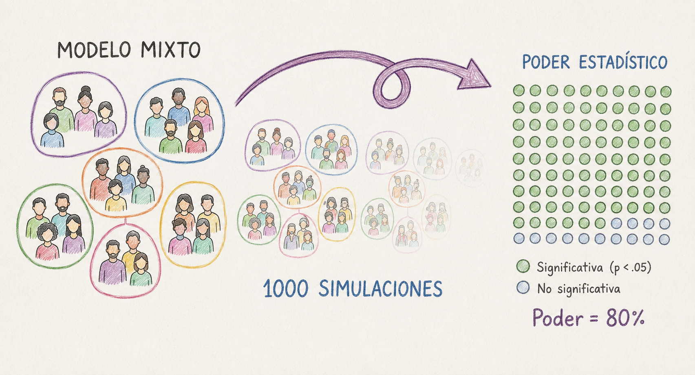
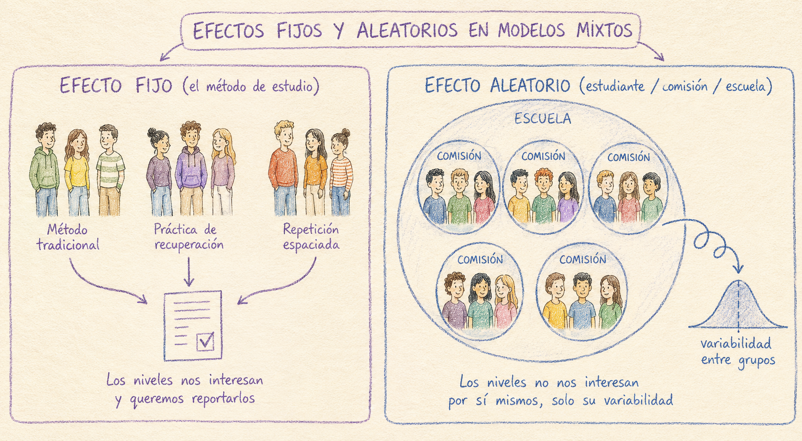
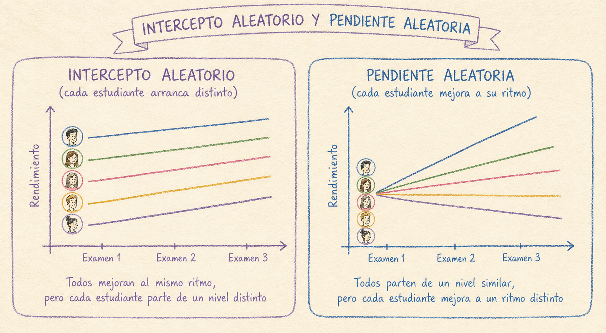

## Retomando donde dejamos en la Parte 1 del tutorial

En la [Parte 1](./poder1.qmd), calcular el poder era resolver una ecuación: dados $\alpha$, el tamaño del efecto ($d$, $f$, $r$ o $R^2$) y $n$, existe una expresión matemática exacta que despeja el cuarto valor. Eso funciona porque nuestro diseño incluía observaciones independientes y, por lo tanto, el modelo tenía **una sola fuente de variación aleatoria**. En nuestro ejemplo, queriamos conocer el efecto de 2 o 3 métodos de estudio distintos sobre el rendimiento de un grupo de estudiantes en un examen. Cada estudiante rindió el examen una vez, y utilizó un solo método de estudio, y esa fue toda la aleatoriedad que tuvimos que modelar. Bajo esas condiciones, el poder tiene una fórmula cerrada y paquetes como `pwr` o `pwr2` la resuelven directamente.

Ahora imaginemos el mismo estudio, pero cada estudiante rinde el examen tres veces a lo largo del año, y además administramos la prueba en muchas comisiones distintas. Tenemos **múltiples fuentes de variabilidad aleatoria**:

- Cuánto varían los estudiantes entre sí (algunos rinden mejor que otros en general).
- Cuánto varía el ritmo de mejora de cada estudiante (algunos progresan más rápido que otros).
- Cuánto varían las comisiones entre sí (una comisión puede rendir mejor que otra en general, por ejemplo, por efecto del/de la docente).
- y cuánto varía cada estudiante examen a examen, más allá de todo lo anterior.

Para saber si vamos a detectar la diferencia entre métodos, ya no alcanza con comparar "la diferencia entre grupos" contra "un solo desvío estándar", como hacía la $d$ de Cohen. Ahora esa diferencia entre métodos tiene que abrirse paso a través de cuatro fuentes de variabilidad superpuestas, y cada una empuja el resultado en una dirección distinta. No hay una manera de combinar esas cuatro cosas en un único número y meterlo en una fórmula, como sí podíamos hacer con $d$ o $f$. 

Entonces ¿qué hacemos?. Antes de meternos de lleno con el método, definamos algunas cuestiones clave. 


## ¿Cuándo necesito un modelo mixto?

La señal más clara de que necesitás un modelo mixto es que tus observaciones **no son todas independientes entre sí**. Dicho de otra forma, necesitás un modelo mixto si sabér el valor de una observación te da información sobre otra observación del mismo grupo, aunque el valor en la variable de interés (en este caso, método de estudio) sea distinto. Esto sucede típicamente en dos situaciones que muchas veces se combinan.

### 1. Medidas repetidas

Supongamos que, en lugar de que cada estudiante rinda el examen una sola vez, le pedimos que lo rinda **tres veces** a lo largo del cuatrimestre, para ver si el método de estudio mejora el desempeño con el tiempo. Ahora tenemos 3 observaciones por estudiante, y esas 3 observaciones (¡esto es lo importante!) **se parecen más entre sí que las observaciones de dos estudiantes distintos**. Un estudiante que rinde bien en el primer examen probablemente también rinda relativamente bien en el segundo y el tercero, más allá del método de estudio que le tocó. De igual forma, un estudiante que rinde mal en el primer examen, probablemente también rinda relativamente mal en los otros dos. 

Si tuvieramos 40 estudiantes, cada uno evaluado 3 veces, y tomaramos las 120 medidas resultantes como si fueran independientes, estaríamos **inflando artificialmente el tamaño de la muestra** y, con eso, subestimando el error real de nuestras estimaciones.

### 2. Datos anidados o jerárquicos

Otra situación frecuente es que las observaciones no sean totalmente independientes porque algunas se parecen más entre sí que otras. Por ejemplo, si los estudiantes se encuentran agrupados en comisiones, y las comisiones en escuelas. Dos estudiantes de la misma comisión comparten un mismo profesor, el mismo horario, el mismo clima de aula. Eso genera una correlación entre sus puntajes que no tiene nada que ver con el método de estudio que estamos evaluando, pero que **sí afecta cuánta información nueva** aporta cada estudiante adicional.

::: {.callout-note}

A este problema se lo conoce como **pseudorreplicación**, tratar observaciones correlacionadas como si fueran réplicas independientes. El resultado práctico es un error de tipo I inflado: vas a "encontrar" efectos significativos con más frecuencia de la que tu $\alpha$ nominal promete, porque el análisis cree que tiene más información independiente de la que realmente tiene.

:::

### El denominador común

En ambos casos (medidas repetidas y datos anidados) el problema es el mismo. Hay **más de una fuente de variación aleatoria** operando al mismo tiempo. En la Parte 1 la única aleatoriedad era estudiante a estudiante, dentro de un mismo método de estudio. Ahora se le suma, por ejemplo, "examen a examen dentro del mismo estudiante" o "estudiante a estudiante dentro de la misma comisión". Un modelo que no distingue estas fuentes de variación va a atribuir toda la variabilidad a una sola cosa, y las estimaciones de error van a ser incorrectas.

Los modelos mixtos están diseñados justamente para estos casos. Le permiten al modelo separar la variación "dentro de un grupo" (por ejemplo, entre exámenes de un mismo estudiante) de la variación "entre grupos" (entre estudiantes, entre comisiones, entre escuelas), en lugar de mezclarlas todas en un único término de error.

## Efectos fijos y efectos aleatorios

En un modelo mixto, cada variable se clasifica como **efecto fijo** o **efecto aleatorio**.

Un **efecto fijo** es una variable cuyos niveles **nos interesan específicamente** y que quisiéramos reportar como tales. En nuestro ejemplo, el método de estudio (tradicional, práctica de recuperación, repetición espaciada) es un efecto fijo. Es exactamente el mismo tipo de variable que ya veníamos usando en la Parte 1 con `pwr.anova.test()` o `pwr.f2.test()`.

Un **efecto aleatorio** es una variable que agrupa las observaciones, cuyos niveles específicos **no nos interesan por sí mismos** pero pueden ser fuente de variabilidad que afecte la estimación que queremos hacer. La variabilidad propia del estudiante (si tenemos medidas repetidas), o la de la comisión o la escuela particular (si nuestros datos están anidados) no son el objeto de nuestra pregunta de investigación, pero necesitamos cuantificarla para poder distinguirla de la variabilidad introducida por la variable que nos interesa realmente.



Entonces:

- Si tenemos **medidas repetidas** el estudiante es un efecto aleatorio. Cada estudiante rinde el examen tres veces, y ese agrupamiento (hay tres observaciones que pertenecen a la misma persona) es lo que el modelo necesita tener en cuenta.

- Si tenemos **datos anidados**, tanto la comisión como la escuela son efectos aleatorios. Los estudiantes están anidados dentro de comisiones, y las comisiones dentro de escuelas.

Incorporar una variable al análisis como efecto fijo o aleatorio determina qué inferencia podemos hacer con ella: sobre un efecto fijo estimamos y probamos una hipótesis puntual (¿difiere el método de estudio tradicional de la práctica de recuperación?); sobre uno aleatorio solo cuantificamos cuánta variabilidad aporta, sin testear niveles específicos.


## Intercepto aleatorio vs. pendiente aleatoria

Dentro de los efectos aleatorios hay todavía una distinción más para tener en cuenta, porque afecta directamente cómo vamos a modelar los datos:

- Un **intercepto aleatorio** por estudiante permite que cada estudiante tenga su propio nivel promedio de partida (algunos estudiantes rinden mejor en general y otros rinden peor, más allá del método), pero asume que el *efecto del método de estudio* es el mismo para todos.

- Una **pendiente aleatoria** permite además que el efecto de una variable (por ejemplo, cómo cambia el puntaje entre el primer y el tercer examen) varíe de estudiante a estudiante: algunos mejoran más rápido con la repetición espaciada que otros.





## La lógica de la simulación de datos

Como no podemos despejar el poder de una fórmula, lo estimamos por fuerza bruta: **simulamos muchas veces** cómo se vería el experimento si el efecto que suponemos fuera cierto, y contamos en qué proporción de esas simulaciones el análisis efectivamente detecta el efecto. Esa proporción, con suficientes repeticiones, es una estimación del poder.

El procedimiento general es:

1. **Especificar el modelo completo**, con valores concretos para todos los efectos fijos y todos los componentes de varianza aleatoria. 

2. **Simular un dataset completo** a partir de ese modelo: para cada estudiante, cada comisión, cada examen, generar un puntaje simulado que sea consistente con los efectos fijos y aleatorios que especificamos.

3. **Ajustar el modelo mixto real** sobre ese dataset simulado, y anotar si el efecto de interés (el método de estudio) resulta estadísticamente significativo o no.

4. **Repetir los pasos 2 y 3 muchas veces** (típicamente cientos), y calcular la proporción de repeticiones en las que el efecto resultó significativo. Por ejemplo, si en 1000 simulaciones 80% mostraron un efecto significativo del método de estudio, el poder es 80%.

## Cálculo del poder con R

Vamos a poner en práctica los cuatro pasos para el siguiente diseño: el método de estudio es asignado por comisión, no por estudiante. Cada comisión usa un solo método. Además, cada estudiante es evaluado 3 veces. También asumimos que el progreso no será equivalente en cada participante, por lo que incluiremos una pendiente aleatoria. 

Para ello vamos a usar el paquete `lme4` [@bates2015lme4] para especificar el modelo mixto, y `simr` [@green2016simr] para simular datos a partir de ese modelo y estimar el poder.

```{r, message=FALSE, warning=FALSE}

# install.packages(c("lme4", "simr"))
library(lme4)
library(simr)
library(dplyr)

```


### Creamos la estructura de los datos

`simr` necesita un `data.frame` con la estructura completa del diseño (todas las combinaciones de comisión, estudiante y examen), aunque los puntajes todavía no existan, se los va a inventar la simulación. Armamos 6 comisiones (2 por método), 8 estudiantes por comisión y 3 exámenes por estudiante:


```{r}

n_comisiones <- 6                    
n_estudiantes_por_comision <- 8
n_examenes <- 3                      

metodo_por_comision <- rep(c("tradicional", "recuperacion", "espaciada"), each = 2)
metodo_por_comision

comision_id <- 1:n_comisiones # ID de cada comisión

comision_estudiante <- rep(comision_id, each = n_estudiantes_por_comision) # Creamos a los estudiantes
comision_estudiante

metodo_estudiante <- rep(metodo_por_comision, each = n_estudiantes_por_comision) # Creamos al vector de método por estudiante
metodo_estudiante

estudiante_id <- 1:(n_comisiones * n_estudiantes_por_comision) # Creamos el ID de cada estudiante

comision <- factor(rep(comision_estudiante, each = n_examenes))
metodo  <- factor(rep(metodo_estudiante, each = n_examenes),
                         levels = c("tradicional", "recuperacion", "espaciada"))
estudiante  <- factor(rep(estudiante_id, each = n_examenes))
numero_examen <- rep(0:2, times = n_comisiones * n_estudiantes_por_comision)

datos <- data.frame(comision, metodo, estudiante, numero_examen)

head(datos, n = 10) # Primeras 10 filas del data frame

```

### Especificamos el modelo con `makeLmer()`

Usamos notación de @bates2015lme4 para definir nuestro modelo: 

```
puntaje ~ metodo * numero_examen + (1 + numero_examen | estudiante) + (1 | comision)

```
- **`puntaje`** es la variable respuesta o dependiente, y la ubicamos a la izquierda de la virgulilla (~).
- **`metodo * numero_examen`** son los efectos fijos. El `*` es una forma abreviada de escribir `metodo + numero_examen + metodo:numero_examen`:  incluimos el efecto de cada variable por separado, y también su interacción porque suponemos que la progresión entre el primer y el último examen no es igual para los tres métodos. 
- **`(1 + numero_examen | estudiante)`** es el efecto aleatorio de estudiante: intercepto aleatorio (el `1`) más pendiente aleatoria de `numero_examen`.
- **`(1 | comision)`** es el efecto aleatorio de comisión, solo intercepto. Asumimos que no tiene sentido una pendiente aleatoria acá, porque cada comisión ya usa un único método y no tiene su propia trayectoria en el tiempo más allá de la de sus estudiantes.


Nos importa saber el tipo de cada variable para saber cómo se interpreta el modelo:

- `numero_examen` es **numérica** (0, 1, 2): R la trata como una pendiente continua, un único coeficiente que representa cuánto sube el puntaje por cada examen adicional. Usamos 0, 1 y 2 en lugar de 1, 2 y 3 para que el intercepto del modelo coincida con el primer examen. 
- `metodo` es **categórica**, con 3 niveles (tradicional, recuperación, espaciada). R no le asigna un coeficiente a cada nivel; en cambio, toma uno como referencia. Toma el que pusimos primero al definir los niveles del modelo (`levels = c("tradicional", "recuperacion", "espaciada")`) y estima **diferencias respecto a esa referencia** para los otros dos.

**¿Y qué es el intercepto, entonces?** el puntaje esperado cuando todas las variables están en su valor de referencia. Como `numero_examen = 0` es el examen 1, y `tradicional` es el nivel de referencia de `metodo`, el intercepto **es la media del examen 1 para el método tradicional**. 

Con eso en mente, los seis coeficientes del modelo se leen así:

| Coeficiente | Qué representa | Valores que le asignamos |
|---|---|---|
| `(Intercept)` | Puntaje esperado en el examen 1, método tradicional | 68.5 |
| `metodorecuperacion` | Cuánto más alto arranca recuperación, respecto a tradicional, en el examen 1 | 73 - 68.5 = 4.5 |
| `metodoespaciada` | Cuánto más alto arranca espaciada, respecto a tradicional, en el examen 1 | 77.5 - 68.5 = 9 |
| `numero_examen` | Cuánto mejora el puntaje por examen, en el método tradicional | 2 |
| `metodorecuperacion:numero_examen` | Cuánto más rápido (o lento) mejora recuperación, respecto a tradicional, por examen | 1 |
| `metodoespaciada:numero_examen` | Cuánto más rápido (o lento) mejora espaciada, respecto a tradicional, por examen | 3 |

-----------------------

**Especificar el modelo completo** implica, entre otras cosas, asignarles valores concretos a todos los coeficientes de esta tabla (los efectos fijos). ¿De donde salen estos valores? Al igual que en la Parte 1 del tutorial, los valores se extraen de los resultados obtenidos de un estudio piloto, o de estudios previos reportados en la bibliografía. En el caso de nuestro ejemplo, seguimos usando las medias del examen 1 de la Parte 1 (método tradicional: 68.5 / recuperación: 73 / repetición espaciada: 77.5), y le sumamos una hipótesis sobre el *ritmo de mejora* de cada método: asumimos que la recuperación y la repetición espaciada no solo empiezan más altas que el método tradicional, sino que mejoran más rápido examen a examen. Quienes utilizan el método tradicional mejoran en promedio 2 puntos por examen. Quienes utilizan la recuperación mejoran 1 punto más por examen que quienes usan el método tradicional y quienes usan la repetición espaciada 3 puntos más. 


```{r}

# Efectos fijos
fixef_vals <- c(68.5, 4.5, 9.0, 2, 1, 3)

# Matriz de varianza y covarianza del intercepto y la pendiente aleatoria por estudiante
var_estudiante <- matrix(c(64, 0,
                           0, 2.25), nrow = 2)   

# Varianza del intercepto aleatorio por comisión
var_comision <- 16       

# Desvío residual (examen a examen, dentro del propio estudiante)
sigma_residual <- 6

```

También tenemos que indicar la **matríz de varianza y covarianza del intercepto y la pendiente aleatoria por estudiante**. Es una matriz de 2x2 porque estudiante tiene dos efectos aleatorios: intercepto (1) y pendiente de numero_examen. La diagonal son las varianzas: le asigno un desvió estándar de 8 (varianza = $8^2$ = 64) a la variación entre estudiantes en su nivel de partida (algunos estudiantes rinden mejor que otros en el examen 1, más allá del método) y un desvío estándar de 1.5 (varianza = $1.5^2$ = 2.25 a la variación entre estudiante en su ritmo de mejora). Fuera de la diagonal va la covarianza entre ambos: asumimos que el nivel de partida de un estudiante no predice qué tan rápido va a mejorar, por lo tengo le asignamos 0.
La **varianza asociada a la comisión** es un único número porque comisión tiene un único efecto aleatorio en nuestro modelo, el intercepto. Suponemos un desvío de 4, una varianza de 16.
Finalmente, el **sigma residual** es el devío del "ruido" que queda despues de descontar el efecto del método, la tendencia general y las desviaciones propias de cada estudiante y cada comisión. La variabilidad de cada examen puntual que no se explica por nada sistemático (por ejemplo, si tuvo un buen o un mal día el estudiante).

Con todos esos valores definidos, ya podemos simular nuestro modelo con `makeLmer()`.


```{r}

modelo <- makeLmer(
  puntaje ~ metodo * numero_examen + (1 + numero_examen | estudiante) + (1 | comision),
  fixef   = fixef_vals,
  VarCorr = list(var_estudiante, var_comision),
  sigma   = sigma_residual,
  data    = datos
)

print(modelo)
```
### Calculamos el poder para nuestro diseño con `powerSim()`

La pregunta concreta que nos interesa es si **la repetición espaciada mejora más rápido, examen a examen, que el método tradicional**. Eso es exactamente el coeficiente `metodoespaciada:numero_examen` del modelo.

```{r}
set.seed(222) # para que puedas reproducir el ejemplo

prueba_interaccion <- fixed("metodoespaciada:numero_examen", "z")

resultado_piloto <- powerSim(modelo, test = prueba_interaccion, nsim = 100, progress = FALSE)
resultado_piloto

```
Con las 6 comisiones (48 estudiantes, 144 observaciones), el poder ronda el **50%**, muy por debajo del 80% que buscamos. Para poner a prueba la hipótesis que nos interesa, con un diseño así de chico no alcanza.

::: {.callout-note}

**¿Cuántas simulaciones hacer?**
En este tutorial usamos `nsim = 100` para que los ejemplos corran rápido, pero **no es el valor que deberías usar en un análisis real**. El propio valor por default de `powerSim()` y `powerCurve()` en `simr` es `nsim = 1000` (Green y MacLeod 2016), y esa no es una casualidad: cada estimación de poder es, en el fondo, una proporción (cuántas de las `nsim` simulaciones dieron un resultado significativo), y como toda proporción estimada por simulación, tiene su propio error de muestreo.

Ese error se puede calcular directamente: el error estándar de una proporción es $\sqrt{p(1-p)/n_{sim}}$. Con un poder real cercano a 80% y `nsim = 100`, ese error estándar ronda los 4 puntos porcentuales, lo que da un intervalo de confianza del 95% de casi 16 puntos de ancho. Con `nsim = 1000`, ese mismo error estándar baja a poco más de 1 punto porcentual, y el intervalo se angosta a menos de 5 puntos.

**En la práctica:** para explorar el diseño y tener una primera idea (como venimos haciendo en este tutorial), `nsim = 100` alcanza. Para un número que vayas a poner en un protocolo, un pre-registro o un pedido de financiamiento, corré la versión final con `nsim = 1000` o más.

:::


### Extendemos el diseño y trazamos la curva de poder

La pregunta real de investigación no es "¿nos alcanzan 6 comisiones de 8 alumnos cada una?" sino "¿cuántas comisiones/estudiantes necesitamos?". Para esto, usamos `extend()` que nos permite escalar el diseño en alguna de esas dimensiones manteniendo la misma estructura. Probemos extender el número de comisiones, manteniedo los 8 estudiantes por comisión, 3 exámenes:

```{r}
modelo_extendido <- extend(modelo, along = "comision", n = 30)

curva_poder <- powerCurve(
  modelo_extendido,
  test    = prueba_interaccion,
  along   = "comision",
  breaks  = c(6, 10, 14, 18, 22, 26, 30), # Distintas cantidades de comisiones
  nsim    = 100,
  progress = FALSE
)

plot(curva_poder)
curva_poder
```

En 14 comisiones el poder todavía no llega el 80%, mientras que con 18 comisiones lo supera. Podriamos calcular el poder exacto para 17 comisiones (te invito a hacer la prueba). 

Probemos otra cosa. ¡Aumentemos el número de estudiantes por comisión!


```{r}
modelo_extendido_estudiante <- extend(modelo, along = "estudiante", n = 192)  
# 32 por comisión, 6 comisiones

curva_poder_estudiante <- powerCurve(
  modelo_extendido_estudiante,
  test    = prueba_interaccion,
  along   = "estudiante",
  breaks  = c(48, 72, 96, 120, 144, 168, 192),  # 8, 12, 16, 20, 24, 28, 32 por comisión
  nsim    = 100
)

plot(curva_poder_estudiante)
curva_poder_estudiante

```
El gráfico permite inferir que con 24 estudiantes por comisión, 6 comisiones, 3 evaluaciones por estudiante, tenemos un poder superior al 80%. ¡Confirmemoslo! A continuación encontrarás el código integrado, armado desde cero. 

```{r}
set.seed(42)

# Estructura de datos: 6 comisiones, 24 estudiantes por comision, 3 examenes 
n_comisiones <- 6
n_estudiantes_por_comision <- 24
n_examenes <- 3

metodo_por_comision <- rep(c("tradicional", "recuperacion", "espaciada"), each = 2)
comision_id <- 1:n_comisiones

comision_estudiante <- rep(comision_id, each = n_estudiantes_por_comision)
metodo_estudiante    <- rep(metodo_por_comision, each = n_estudiantes_por_comision)
estudiante_id        <- 1:(n_comisiones * n_estudiantes_por_comision)

comision      <- factor(rep(comision_estudiante, each = n_examenes))
metodo        <- factor(rep(metodo_estudiante, each = n_examenes),
                         levels = c("tradicional", "recuperacion", "espaciada"))
estudiante    <- factor(rep(estudiante_id, each = n_examenes))
numero_examen <- rep(0:2, times = n_comisiones * n_estudiantes_por_comision)

datos <- data.frame(comision, metodo, estudiante, numero_examen)

# Modelo con los mismos supuestos de siempre 
fixef_vals <- c(68.5, 4.5, 9.0, 2, 1, 3)
var_estudiante <- matrix(c(64, 0,
                             0, 2.25), nrow = 2)
var_comision <- 16
sigma_residual <- 6

modelo_24 <- makeLmer(
  puntaje ~ metodo * numero_examen + (1 + numero_examen | estudiante) + (1 | comision),
  fixef   = fixef_vals,
  VarCorr = list(var_estudiante, var_comision),
  sigma   = sigma_residual,
  data    = datos
)

# Poder puntual para esta configuración (144 estudiantes en total)
prueba_interaccion <- fixed("metodoespaciada:numero_examen", "z")

resultado_24 <- powerSim(modelo_24, test = prueba_interaccion, nsim = 1000)
resultado_24
```
Confirmamos nuestro análisis anterior. ¡Perfecto! Ahora nos queda un último paso: reportar el análisis que hicimos.

### Cómo reportar el cálculo del tamaño muestral

Aquí les dejo un texto ejemplo de cómo contar el análisis que hicimos para un preregistro. No es un texto estándar, se puede modificar. Lo importante es incluir todos los componentes que usamos para simular los datos y calcular el poder, incluyendo las distintas fuentes de variabilidad y la hipótesis que nos interesa testear:  

::: {.callout-note appearance="simple" icon="false"}

El tamaño muestral se determinó mediante un análisis de poder por simulación (Monte Carlo) usando el paquete `simr` en R, sobre un modelo lineal mixto especificado con `lme4`. El diseño incluyó 6 comisiones (2 por cada uno de los 3 métodos de estudio: tradicional, práctica de recuperación, repetición espaciada), 24 estudiantes por comisión (144 estudiantes en total), evaluados en 3 exámenes a lo largo del cuatrimestre.

Modelo: puntaje ~ metodo * numero_examen + (1 + numero_examen | estudiante) + (1 | comision).

Hipótesis a testear: que el puntaje de los estudiantes bajo repetición espaciada mejora más rápido, examen a examen, que bajo el método tradicional (coeficiente de interacción metodo:numero_examen), evaluado mediante un test z sobre el coeficiente metodoespaciada:numero_examen, con $\alpha$ = .05.

A partir de *los resultados obtenidos en un estudio piloto/a partir de los valores reportados por autor (año)* se asumen medias de 68.5, 73 y 77.5 en el examen 1 para tradicional, recuperación y espaciada respectivamente; mejoras de 2, 3 y 5 puntos por examen; desvío estándar entre estudiantes de 8 (intercepto) y 1.5 (pendiente), sin correlación entre ambos; desvío estándar entre comisiones de 4; desvío residual de 6.

Con este diseño, y basado en 1000 simulaciones, el poder estimado para detectar el efecto de interés es de 89.5% (IC 95%: 87.4%–91.3%). El código completo utilizado para este análisis de poder está disponible en [enlace al repositorio / material suplementario].

:::

## Agradecimientos

Además de los textos citados a lo largo del tutorial, usé como referencia los siguientes materiales:

- El tutorial [Power Analysis with simr](https://humburg.github.io/Power-Analysis/simr_power_analysis.html) de Peter Humburg.
- El tutorial [A-Priori Power Analysis for Multilevel Models](https://thechangelab.stanford.edu/tutorials/power-analysis/a-priori-power-analysis-for-multilevel-models/) del grupo The Change Lab de la Universidad de Stanford. 

Quiero agradecer especialmente a mi directora de posdoctorado y de carrera, [Débora Burín](https://www.linkedin.com/in/d-i-burin-644ba52/), quien me contagió el entusiasmo por los análisis reproducibles y se sentó conmigo, en más de una ocasión y con enorme paciencia, a desentrañar líneas de código y ayudarme a entender cómo realizar e interpretar estos cálculos.

## Cómo citar este tutorial

Si te resultó útil, este tutorial está disponible bajo una licencia [Creative Commons Attribution 4.0 International (CC BY 4.0)](https://creativecommons.org/licenses/by/4.0/deed.es). Esto quiere decir que podés compartirlo y adaptarlo libremente siempre que cites la fuente.

Formoso, J. (2026, July 12). ¿Cuántas observaciones necesito para poner a prueba mi hipótesis? Cálculo del tamaño muestral. Zenodo. [https://doi.org/10.5281/zenodo.21326331](https://doi.org/10.5281/zenodo.21326331)


---

*¿Preguntas o sugerencias? Dejá un issue [aquí](https://github.com/JFormoso/jformoso.github.io/issues) o escribime a [jesica.formoso@gmail.com](mailto:jesica.formoso@gmail.com) con tus comentarios.*

